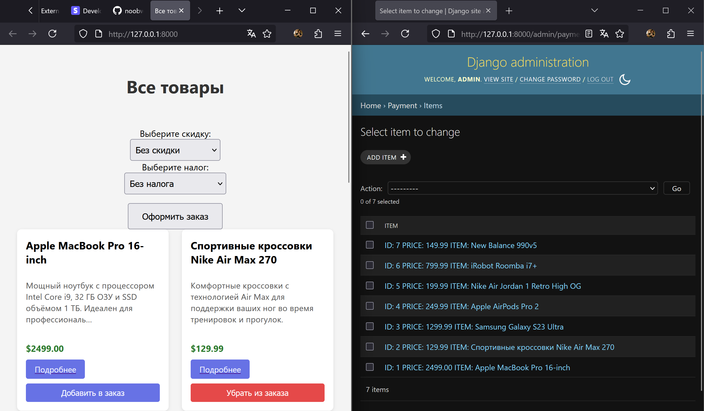

### **Тестовое задание: Django c использованием платежной системы Stripe API  😇**
- Ознакомиться с результатом можно по репозиторию или ссылкам ниже:
```
stripe.noobweer.ru — страница с товарами
stripe.noobweer.ru/admin/ — админ-панель Django
```
```
admin:88238823Admin — login:pass от админ-панели Django
```

- Комментарий:
> Я реализовал веб-приложение на основе стандартной административной панели Django и базы данных SQLite. Интерфейс фронтенда построен с использованием чистого HTML, CSS и JavaScript, без применения сторонних фреймворков. 
> Основной функционал приложения — демонстрация интеграции с платежной системой Stripe , позволяющей протестировать различные сценарии оформления заказов: 

1. Весь обязательный функционал из тестового задания.
2. Применение скидок  (Discounts) к отдельным товарам или ко всему заказу.
3. Добавление налогов  (Tax Rates) к стоимости товаров.
4. Возможность покупки нескольких товаров одним заказом (Checkout Session).

> При разработке проекта использовались переменные окружения (environment variables) для безопасного хранения API-ключей Stripe и других конфиденциальных данных.
> К сожалению, не был реализован запуск приложения через Docker — в будущем планирую освоить и внедрять его в свои проекты. Также пока не добавлена поддержка нескольких валют, так как Stripe не позволяет создавать отдельные API-ключи под каждую валюту, а создавать отдельный аккаунт для каждой валюты — избыточно.
### **Установка и запуск на Windows**
- Клонируйте репозиторий
```bash
git clone https://github.com/noobweer/stripe-payment.git
```
- Создайте виртуальное окружение и установите зависимости
```bash
python -m venv venv
venv\Scripts\activate
cd stripe-payment
pip install -r requirements.txt
```
- Примените миграции, создайте суперпользователя и запускайте
```bash
python manage.py migrate
python manage.py createsuperuser
python manage.py runserver
```
#### **Главная страница**
```
http://127.0.0.1:8000/
```
#### **Страница товара**
```
http://127.0.0.1:8000/item/{id}
```
#### **Админ-панель**
- Панель администратора доступна по ссылке (необходима авторизация):
```
http://127.0.0.1:8000/admin/
```
#### **Эндпоинты**
-Покупка товара одного товара
```
http://127.0.0.1:8000/buy/{id}
```
-Покупка 1+ товаров ордером
```
http://127.0.0.1:8000/order/
```
```json
{
  "order": ["СПИСОК СТРОК ID ВЫБРАННЫХ ТОВАРОВ"],
  "discount_id": "СТРОКА ID СКИДКИ ИЛИ ПУСТАЯ СТРОКА, ЕСЛИ СКИДКА НЕ ВЫБРАНА",
  "tax_id": "СТРОКА ID НАЛОГА ИЛИ ПУСТАЯ СТРОКА, ЕСЛИ НАЛОГ НЕ ВЫБРАН"
}
```